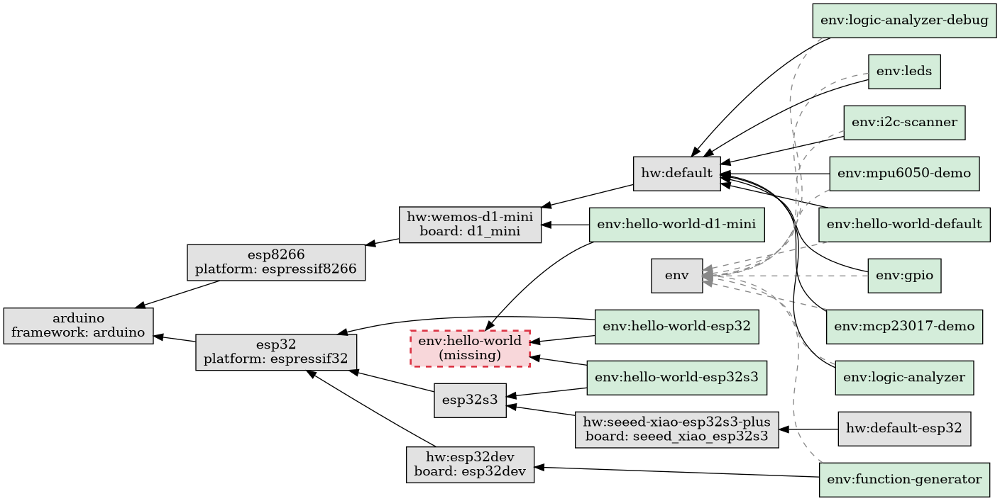

# pio-env-graph

> ⚠️ **Early development** — this project is in beta. The core functionality works but the API and CLI flags may change between releases. Feedback and bug reports are welcome.

Visualize `extends` dependencies between sections in `platformio.ini` as a Graphviz DOT graph.

## Install

From PyPI (once published):

```bash
pip install pio-env-graph
```

From source:

```bash
pip install -e .
```

## Usage

```bash
pio-env-graph                                          # auto-discovers ./platformio.ini
pio-env-graph /path/to/platformio.ini                  # explicit path
pio-env-graph -o graph.dot                             # write to file
pio-env-graph | dot -Tpng -o graph.png                 # render to PNG
pio-env-graph -d LR                                    # left-to-right (default: RL)
pio-env-graph --refs                                   # include ${section.key} references
pio-env-graph | dot -Tpng | display -                  # render and display immediately
```

Directions: `RL` (right-to-left, default), `LR`, `TB`, `BT`.

## Examples

### Default (RL)


### Top to bottom

```bash
pio-env-graph -d TB
```


### With `${section.key}` references

```bash
pio-env-graph --refs
```



## Development

The Makefile handles venv setup automatically on first run:

```bash
make test               # run tests
make lint               # check formatting + lint
make format             # auto-format code
```

Or set up manually:

```bash
python3 -m venv .venv
source .venv/bin/activate
pip install -e .
pip install -r requirements-dev.txt
```
